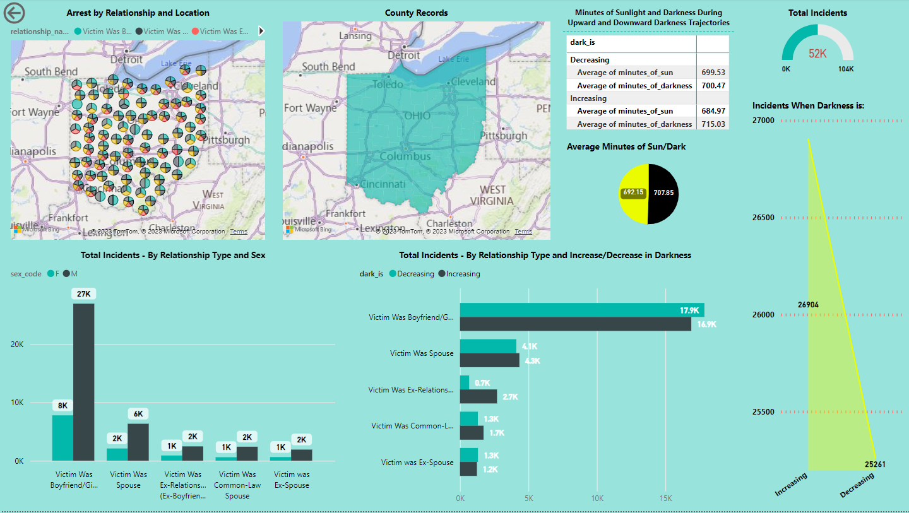
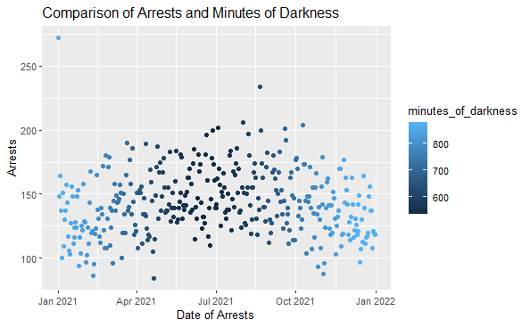
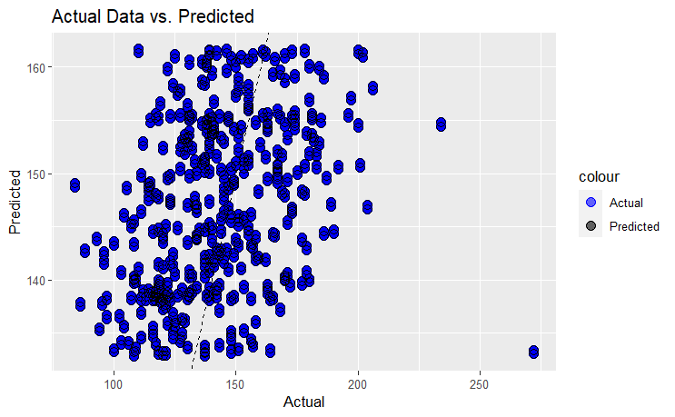

# Capstone I
For this study we will investigate if weather or sunlight, has any corelation to how couples and/or ex-couples behaved in an exaggerated manner.
For this study we obtained 2021 arrest records for the state of Ohio. This data was obtained in a zip file containing 42 csv files and 
instructions to assemble in PostgreSQL. Upon completion of the database in Postgres, a query was performed obtaining arrest 
data involving a spouse, ex-souse, couple, or ex-couple. Missing from from the arrest data was any type of meterological data. 
Sunrise/Sunset data was obtained for Ohio in 2021, as well as latitude and longitude information. A new PostgreSQL database was created to housing a crime_data table, (sunrise/sunset) dark table, and a lat_lon table.
In R Studio a connection was made to the PostgeSQL database and a query was performed for the testing.

# Tools and Procedures:
PostgreSQL  
R Studio [My RStudio File](Dark_Arrest_Couple_Study_11.3.2023.Rmd)
PowerBI [Download Power BI Report](capstone_dashboard.pbix)

# Data Sets:
2021 Ohio Crime data:
    Source: https://cde.ucr.cjis.gov/LATEST/webapp/#/pages/downloads
    Reason for Source - To obtain multiple details of arrests over 1 year
    Data type description - 42 sql tabls compliling over 400,000 arrest records 
    Assembled in PostgreSQL, where a query of info was used for the study

Latitude and Longitude data: 
    Source: https://public.opendatasoft.com
    Reason Source - to add latitude and longitude coordinates to the crime data 
    (crime data only shows reporting county, not actual incident address)
    Data type description = XML file converted in which was converted to a PostgreSQL table

Ohio 2021 Sun Dark Data: 
    Source: https://aa.usno.navy.mil/data/index
    Reason Source - to add sunrise and sunset data to the study for daylight analysis
    Data type description = XML file converted in which was converted to a PostgreSQL table
    

# Hypothesis:
Ha: As the minutes of sunlight decrease in a 24 period, there is no change to arrests between 
couples and ex-couples.

Ho: As the minutes of darkness increase in a 24 hour period, arrests increase between couples 
and ex-couples.

# Analysis:
Step I: 
Obtained data from various sources, compiled the data into a database for querries. Connected 
PostrgreSQL to PowerBI and R Studio for testing and analysis.

Step II: 
Created a Dashboard in PowerBI, with visuals regarding increasing darkness and arrest records. 
This allowed a quick understanding the data for the anlaysis in R.   

Querried the data from R Studio and formatted for testing analysis. 

Step III: 
Created additional visualizations in R Studio to view the varible relationships.

 

Calculated the coefficients and aggregated the data to show total incidents by day. 

Increasing darkness throughout the year has a very small if any correlation with arrest rates for couples.
Once the data was aggregated, a Poisson Test was performed, testing if the model could predict the arrests by the amount of minutes of darkness in a day. The low coefficient with minutes of darkness and arrests, provided the model little help. 

Poisson Test Results:
Call:  glm(formula = incidents ~ minutes_of_darkness + dark_is + m_f + 
    darker, family = "poisson", data = adf)

Coefficients:
        (Intercept)  minutes_of_darkness              dark_is                  m_f               darker  
          5.3086731           -0.0004841            0.0388679           -0.0028640            0.0089943  

Degrees of Freedom: 52148 Total (i.e. Null);  52144 Residual
Null Deviance:	    239600 
Residual Deviance: 216500 	AIC: 571900

The MAE (mean absolute error is 19.45887), showing on average the model will predict within 19.45 arrests. 
The RMSE (root mean squared error is 25.04585), showing on average the model will predict within 25.04 arrests.

# Final Conclusions:

We conclude the analysis rejecting the alternative hypotheses. The correlation with increased darkness is absent. Given the lack of correlation, the Poisson model had a difficult time predicting the amount of events that would occur on a given day.
The largest correlation to total arrests shows .0388679. Showing a very low significance.